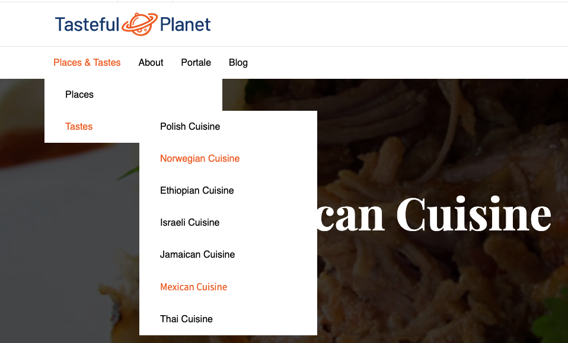
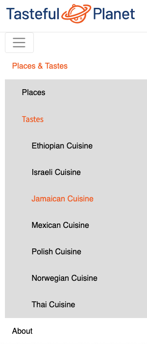

# EzPlatformMenuBundle

`EzPlatformMenuBundle` is a bundle to create multi level navigation in eZ frontend Applications. This bundle is using [KnpMenuBundle](http://symfony.com/doc/master/bundles/KnpMenuBundle/index.html)

The generation of the navigation is siteaccess aware.

## Requirement

eZPlatform 1.x (Open Source or EE), PHP 7+

Note: Be sure that [KnpMenuBundle](http://symfony.com/doc/master/bundles/KnpMenuBundle/index.html) is installed and activated in AppKernel.php (activated per default in eZPlatform 2+)

## Installation

```
composer require arfaram/ezmenubundle:^0.1
```
- Activate the Bundle in AppKernel.php

```
    public function registerBundles()
    {
        $bundles = array(
            new Knp\Bundle\MenuBundle\KnpMenuBundle(),
            //...
            new EzPlatform\MenuBundle\EzPlatformMenuBundle(),
        );
```

  
## Usage

In the Pagelayout template add following code

```
    
        

        {{ knp_menu_render(menu, {
            'template': '@EzPlatformMenu/parts/menu/top_menu.html.twig',
            'currentAsLink': true,
            'currentClass': 'active'
            })
        }}
    
    
```

## Parameters:

### knp_menu_get options
 
- `thisLocationId`: In the template it will add < link > (active) or < span > (inactive) link
- `pathString`: Ìt is used to add an `active` css class in the current < li > path. See `currentClass` 
- `displayChildrenWhenItemClicked`:
    - True: It shows the subitem list of the current clicked item
    - False: It shows all items in all levels
    - Note: You clould use `depth` in knp_menu_render() parameters to control the subitem level to show when `displayChildrenWhenItemClicked:false` 
- `level`: use `main` to render repository navigation. the value should be unique per menu. Using this option you can setup some criterion on ContentType and the ParentLocationId to fetch. See default _main_ settings in config/services/menu_settings.yml 

Example:
```
parameters:
    main.default.contenttypes_identifier.menu: [folder, products, article, product_item]
```

### knp_menu_render options

- `template` default template delivered with this bundle. you could use your own at this step
- `currentAsLink` If true: display current item as a link. For **static** menu this option should be set to _false_. 
- `currentClass` : add your custom css class for active < li > items

## Add static menu using knpMenuBundle (Symfony Route)

An example is already available in `bundle/Doc/Example/StaticMenuBuilder.php`

- You should give a name in `getConfigureEventName()` . This name will be used later in the template and in the service settings. see below

- We will use the same name `site.static_menu` used in this class and be sure that `currentAsLink` is set to false.

- In the template (e.g pagelayout.html.twig)
```
    {{ knp_menu_render('site.static_menu', {
        'currentAsLink': false,
        'currentClass': 'active'
    }) }}
```
- In service.yml

```
services:
    _defaults:
        autowire: true
        autoconfigure: true
        public: false

    EzPlatform\MenuBundle\Doc\Example\StaticMenuBuilder:
        public: true
        tags:
            - { name: knp_menu.menu_builder, method: build, alias: site.static_menu }

```

Note: This class is using some symfony route. They should be available in routing.yml

You should then add following lines on the top of your pagelayout template to avoid exception when you are outside a content. Of course, you can use [siteaccess parameteres](https://doc.ezplatform.com/en/latest/guide/config_dynamic/#configresolver).

```

    

``` 
This allows you to render the main menu using the `locationId=2` and `pathString:/1/2`.

Note: The current Menu template will take over highlighting the current symfony route.

## Add your custom menu class using custom ParentLocationID

In some cases you want to use the same logic like in the main menu to add a custom menu in the Sidebar (list of blog posts or products items) or in the footer (only first level navigation or other category items).

- An example is introduced in `bundle/Doc/Example/FooterMenuBuilder.php`

- You should give a name in `getConfigureEventName()`. This name will be used later in the template and in the service settings. see below

- We will use the same name `site.footer_menu` used in this class.

```
    
        

        {{ knp_menu_render(menu, {
            'template': '@EzPlatformMenu/parts/menu/top_menu.html.twig',
            'currentClass': 'active'
        })
        }}
    

```

- Add the `footer` level in your parameters.yml

```
parameters:
    footer.default.contenttypes_identifier.menu: [folder, blog]
    footer.default.location_id.menu: 2

```


## Add additional items to the repository menu

To be able to add other menu items to the available menu you can add your own EventListner.
 
An example is available in `bundle/Doc/ExampleEventListener/ExtraMainMenuListener.php`


Next example demonstrates how to add a link to the existing main or static menu.

```
services:
    _defaults:
        autowire: true
        autoconfigure: true
        public: false
    EzPlatform\MenuBundle\EventListener\ExtraMainMenuListener:
        tags:
            - { name: kernel.event_listener, event: site.main_menu, method: onMenuConfigure }
            # Or
            - { name: kernel.event_listener, event: site.static_menu, method: onMenuConfigure }
```
